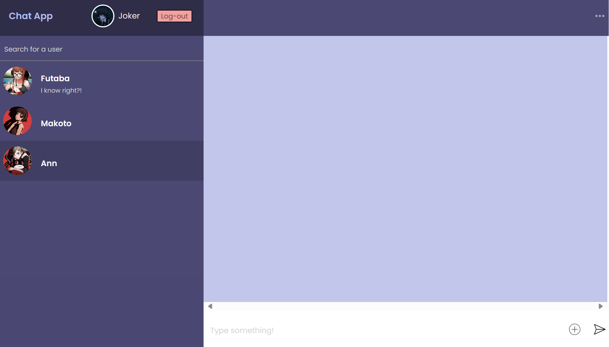

# [Chat App](https://chat-app-2537c.firebaseapp.com/?_gl=1*ou91wd*_ga*MTQzNTI2OTc4OC4xNjk2NjQ5ODA0*_ga_CW55HF8NVT*MTY5Njg5NDkxMS4yLjEuMTY5Njg5NzY0Ni41OS4wLjA.)

<h3>
Messenger app program crafted using React, CSS, and JavaScript, with Firebase integration for real-time private chats. Leverages the Context API for efficient data management
</h3>

<h4 align="center"> Powered by Firebase, users can seamlessly register and log in to enjoy private   conversations while also personalizing their profiles with   profile pictures stored securely in Firebase Storage.</h4> 

    
    

<h4 align="center">In the chat application, I have integrated real-time chat updates facilitated by Firebase's real-time database,  enabling users to extend their network by adding friends through usernames,   and further enhancing their communication by sharing images seamlessly in real-time</h4>  

    
    

